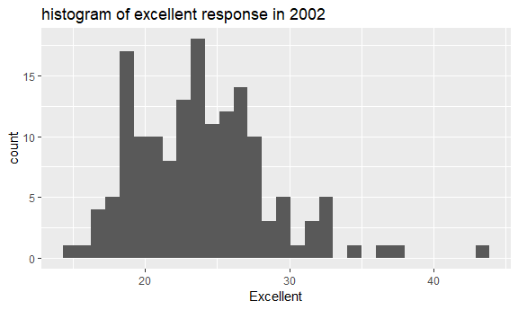
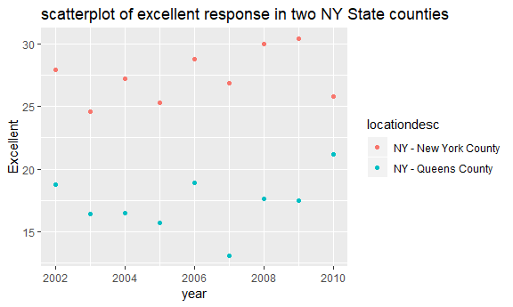

p8105\_hw2\_ml4239
================

Problem 1 NYC transit
=====================

Import and clean &retain some data
----------------------------------

retain line, station, name, station latitude / longitude, routes served, entry, vending, entrance type, and ADA compliance.

``` r
NYC_transit_data<-read_csv("./data/NYC_Transit_Subway_Entrance_And_Exit_Data.csv") %>% 
  janitor::clean_names() %>% 
  select(line, station_name, station_latitude, station_longitude, route1:route11, entry, vending, entrance_type, ada) 
```

    ## Parsed with column specification:
    ## cols(
    ##   .default = col_character(),
    ##   `Station Latitude` = col_double(),
    ##   `Station Longitude` = col_double(),
    ##   Route8 = col_integer(),
    ##   Route9 = col_integer(),
    ##   Route10 = col_integer(),
    ##   Route11 = col_integer(),
    ##   ADA = col_logical(),
    ##   `Free Crossover` = col_logical(),
    ##   `Entrance Latitude` = col_double(),
    ##   `Entrance Longitude` = col_double()
    ## )

    ## See spec(...) for full column specifications.

convert entry variable to from character (`rYES` vs `rNO`) to a logical variable

``` r
ifelse(NYC_transit_data$entry == "YES", TRUE, FALSE) %>% 
  str()
```

    ##  logi [1:1868] TRUE TRUE TRUE TRUE TRUE TRUE ...

The NYC\_transit\_data dataset contains the following variables:
----------------------------------------------------------------

line, station\_name, station\_latitude, station\_longitude, route1, route2, route3, route4, route5, route6, route7, route8, route9, route10, route11, entry, vending, entrance\_type, ada

-   line: tracks that trains run over
-   station\_name: station names
-   station\_latitude: the latitude location of the station
-   station\_longitude: the longitude location of the station
-   route 1-11: route the station serves
-   entry: logical vector to show if the station has entry (TRUE) or not (FALSE)
-   vending: if the station has vending system or not
-   entrance\_type: the type of entrance (stair, elevator, door, etc.)
-   ada: if the station is ADA compliant

The steps that I used to clean the data:
----------------------------------------

After importing the data, I used `clean_names` from `janitor package` to clean the names. And then I select some variables from the original dataset, and convert the 'entry' variable from character to logical variable.

Overview about the dataset
--------------------------

The dimension of the resulting dataset is 1868, 19 after cleaning.

These datas are not tidy because the route number and route name variable are not in their own columns. The variables from route 1 to 11 can be put into the same column as "route\_name"variable.

Questions using these data
--------------------------

-   How many distinct stations are there?

``` r
nrow(distinct(NYC_transit_data, station_name, line ))
```

    ## [1] 465

There are 465 distinct stations which characterized by name and line.

-   How many stations are ADA compliant?

``` r
NYC_transit_data %>% 
filter(ada==TRUE) %>% 
  distinct(station_name,line) %>% 
  nrow()
```

    ## [1] 84

84 stations are ADA compliant.

-   What proportion of station entrances / exits without vending allow entrance?

``` r
  sum(NYC_transit_data$vending == "NO"& NYC_transit_data$entry == "YES")/sum (NYC_transit_data$vending == "NO")
```

    ## [1] 0.3770492

The proportion of station entrances/ exits without vending allow entrance is 0.3770

Reformat data
-------------

so that route number and route name are distinct variables

``` r
NYC_transit_tidy<-gather(NYC_transit_data, key = route_number, value = route_name, route1:route11) 
```

-   How many distinct stations serve the A train?

``` r
NYC_transit_tidy %>% 
  filter(route_name == "A") %>%
  distinct(station_name, line) %>% 
  nrow() 
```

    ## [1] 60

60 dinstinct stations serve the A train.

-   How many of the stations that serve the A train are ADA compliant?

``` r
NYC_transit_tidy %>% 
filter(route_name == "A" & ada == TRUE) %>% 
  distinct(station_name,line) %>% 
  nrow()
```

    ## [1] 17

17 stations that serve the A train are ADA compliant

Problem 2 Mr. Trash Wheel
=========================

Import and clean data Mr. Trash Wheel
-------------------------------------

``` r
Mr.Trash_data<-
  read_excel("./data/HealthyHarborWaterWheelTotals2018-7-28.xlsx", sheet = 1, range = cell_cols("Dumpster:Homes Powered")) %>% 
  select(-X__1) %>% 
  janitor::clean_names() %>% 
  filter(!is.na(dumpster)) %>% 
  mutate(sports_balls = as.integer(ceiling(sports_balls))) 
```

    ## Warning in letter_to_num(x): NAs introduced by coercion to integer range

Read and clean precipitation data for 2016 and 2017.
----------------------------------------------------

``` r
Precipitation_2016_data<-read_excel("./data/HealthyHarborWaterWheelTotals2018-7-28.xlsx", sheet = 5, range = "A2:B14") %>% 
  janitor::clean_names() %>% 
  na.omit() %>% 
  mutate( year = "2016")

Precipitation_2017_data<-read_excel("./data/HealthyHarborWaterWheelTotals2018-7-28.xlsx", sheet = 4, range = "A2:B14") %>% 
  janitor::clean_names() %>% 
  na.omit() %>% 
  mutate( year = "2017")
```

combine datasets and convert month to a character variable

``` r
Precipitation_bind<-
  rbind(Precipitation_2016_data,Precipitation_2017_data) %>% 
  mutate(month = month.name[as.integer(.$month)])
```

Datasets description
--------------------

-   The first dataset is 'Mr. Trash\_data'.

The number of observations in Mr.Trash\_data is 285, 14

This dataset contains record about 'dumpster numbers', 'time of collection' and 'types of litters'.

-   The second dataset is 'precipitation\_bind'.

Variables are month, total precipitation in that month and the year.

The Precipitation\_2016 contains 12 variables.

The Precipitation\_2017 contains 12 variables.

The number of observations in Precipitaion\_bind is 24.

-   Questions

The total precipitation in 2017 is 32.93.

The median number of sports balls in a dumpster in 2016 is 26

Problem 3 BRFSS data
====================

``` r
# install.packages("devtools")
devtools::install_github("p8105/p8105.datasets")
```

    ## Skipping install of 'p8105.datasets' from a github remote, the SHA1 (21f5ad1c) has not changed since last install.
    ##   Use `force = TRUE` to force installation

Read data and clean data
------------------------

``` r
library(p8105.datasets)
data("brfss_smart2010") 
brfss_data<- janitor::clean_names(brfss_smart2010)
brfss_data %>% 
  filter(topic == "Overall Health") %>% 
  select(-class, -topic, -question, -sample_size, -c(confidence_limit_low:geo_location)) 
```

    ## # A tibble: 10,625 x 5
    ##     year locationabbr locationdesc          response  data_value
    ##    <int> <chr>        <chr>                 <chr>          <dbl>
    ##  1  2010 AL           AL - Jefferson County Excellent       18.9
    ##  2  2010 AL           AL - Jefferson County Very good       30  
    ##  3  2010 AL           AL - Jefferson County Good            33.1
    ##  4  2010 AL           AL - Jefferson County Fair            12.5
    ##  5  2010 AL           AL - Jefferson County Poor             5.5
    ##  6  2010 AL           AL - Mobile County    Excellent       15.6
    ##  7  2010 AL           AL - Mobile County    Very good       31.3
    ##  8  2010 AL           AL - Mobile County    Good            31.2
    ##  9  2010 AL           AL - Mobile County    Fair            15.5
    ## 10  2010 AL           AL - Mobile County    Poor             6.4
    ## # ... with 10,615 more rows

``` r
proportion_data<-brfss_data %>% 
  spread(key = response, value = data_value) %>% 
  mutate(EV_responce = ifelse(is.na(Excellent), 'Very good',Excellent))
```

Questions
---------

-   How many unique locations are included in the dataset? Is every state represented? What state is observed the most?

``` r
proportion_data %>% 
 distinct(geo_location) %>% 
  nrow()
```

    ## [1] 404

``` r
proportion_data %>% 
 distinct(locationabbr) %>% 
   nrow()== 51
```

    ## [1] TRUE

``` r
sort(-table(proportion_data$locationabbr))[1]
```

    ##    NJ 
    ## -9215

404 unique locations are included in the dataset and every state is represented.

New Jersey(NJ) is observed the most.

-   In 2002, what is the median of the “Excellent” response value?

``` r
excellent_2002<-proportion_data %>% 
 filter(year == 2002 & !is.na(Excellent))
  median(excellent_2002$Excellent)
```

    ## [1] 23.6

The median of the “Excellent” response value is 23.6 \#\# Graphs Make a histogram of "Excellent" response values in the year 2002.

``` r
ggplot(excellent_2002, aes(x = Excellent))+
         geom_histogram()+ggtitle("histogram of excellent response in 2002")
```

    ## `stat_bin()` using `bins = 30`. Pick better value with `binwidth`.



Make a scatterplot showing the proportion of “Excellent” response values in New York County and Queens County (both in NY State) in each year from 2002 to 2010.

``` r
NY_data<-proportion_data %>% 
filter(locationdesc=="NY - New York County" |locationdesc=="NY - Queens County") %>% 
  filter(!is.na(Excellent)&year %in% c(2002:2010))
ggplot(NY_data, aes(x = year ,y = Excellent,color = locationdesc))+
  geom_point()+labs(title = "scatterplot of excellent response in two NY State counties") 
```


